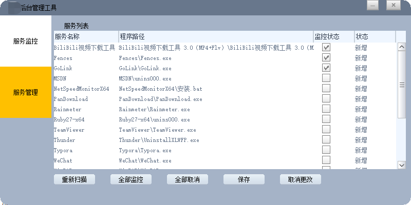
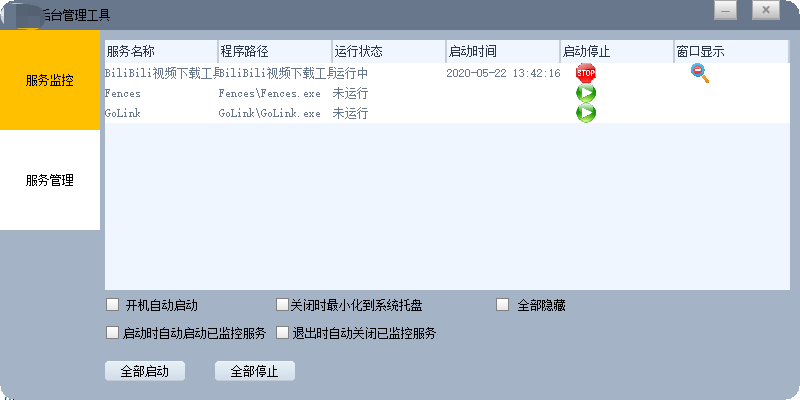
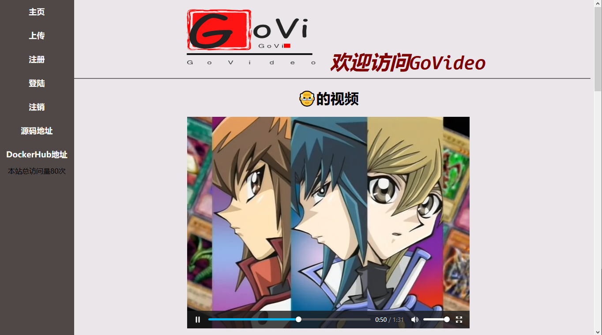

 

     <h1>高俊健</h1>
     

         
             
             13533260451
         
         ·
         
             
             gongluck93@gmail.com
          
         ·
         
             
             <a href="https://github.com/gongluck">https://github.com/gongluck</a>
         
         ·
         
             
             <a href="https://gongluck.github.io">https://gongluck.github.io</a>
         
     

 

 ##  个人信息 

 - 男，1993 年出生
 - 求职意向：**C/C++/go 研发工程师**
 - 工作经验：**4.5 年**
 - 期望薪资：**17k+(年22W)**

##  教育经历

- 本科学士学历，广州中医药大学，计算机科学与技术专业，2012.9~2016.7
- CET4

##  工作经历

- **广东威创视讯科技股份有限公司，VW系统部，高级C++开发工程师，2020.7~2020.10**

   1.流媒体转发服务及对应测试客户端开发。

   2.对接信令服务，设计服务之间的通信协议。

   3.维护原有私有协议媒体服务程序。

- **高新兴科技集团股份有限公司，AR产品线软件研发部，高级C++开发工程师，2018.2~2020.7**

   1.开发维护云防客户端SDK，制定SDK使用接口。

   2.维护多个功能版本客户端SDK，编写单元测试保证版本质量。

   3.开发后台网关程序及后台服务管理程序。

   4.处理项目现场问题。

- **广东安居宝数码科技股份有限公司，监控研发部，C++开发工程师，2016.6~2018.1**

   1.智能监控平台及停车场系统客户端开发。
   
   2.对接第三方显示屏协议和摄像头SDK。

##  项目经历

- **录像分布式存储系统** 2020.7~2020.10

  - **技术栈**：C++(11) + Boost(asio) + 多线程 + http + cgo + nvr

  - **项目介绍**：基于海康NVR设备，对视频录像进行存储和调度管理。用户通过网页，可以对录像文件进行预览下载和定制录像计划。

  - **我的职责**：

    1、对接NVRSDK，封装功能接口，开发nvr服务程序。

    2、对接信令服务，制定服务间(tcp)通信协议并联调测试。

    3、开发流媒体转发功能。对264和aac数据打包成flvtag，使用librtmp转发；基于私有tcp协议转发媒体数据。

  - **工作结果**：在预期内完成nvr服务程序，并快速完成服务间的联调。在原私有协议之外，开发http通信协议和rtmp媒体协议版本，将nvr服务从整个系统中解耦，以供后续独立测试可扩展。

- **VGIS视频地图项目** 2018.6~2020.7

  - **技术栈**：C++(11) + Boost + 多线程 + 动态库 + http + openssl + ndk + qpid + kafka
  - **项目介绍**：AR实景视频地图引擎地理信息系统，VGIS平台以视频为基础，以AR技术为核心，以地理信息技术为支撑，提供实景地图服务、GPS定位服务、数据服务，以服务于业务应用、信息共享和决策支持的可视化AR实景二次开发平台。对比传统的二维和三维GIS地图，使用视频和GIS结合的形式，"视频直播"动态画面中的物体坐标变化。

  - **我的职责**：

    1、根据不同后台版本，对接平台http协议或者SDK，基础设备管理功能到VGISSDK。

    2、VGISSDK接口功能开发和维护。

    3、对接消息上报设备，开发对接网关。

    4、通过日志和dump文件等方式定位现场问题。

    5、优化项目代码管理，使用CMake工具管理跨平台代码。

    6、优化历史数据访问策略，使用redis缓存热门数据，缓解数据库访问压力。

  - **工作结果**：同时维护多个SDK版本，输出稳定的功能。及时处理现场问题，快速定位问题原因。

- **视频OCX控件** 2018.5~2018.6

  - **技术栈**：C++(11) + ocx + GDI + ffmpeg + sdl2

  - **项目介绍**：部门多个项目中需要使用到嵌入设备视频的控件，开发ocx控件以便于后续快速开发相关功能。

  - **我的职责**：

    1、封装公司的GSPlaySDK播放库。

    2、对接人脸分析服务，从流数据中分离出人脸分析结果，并且通过ffmpeg解码h264数据。

    3、对接摄像头设备SDK，集成云台控制和预览功能。

  - **工作结果**：集成多个不同摄像头的SDK，将摄像头管理模块从项目解耦出来，加快后续相关项目的开发进度。

- **后台服务管理工具** 2018.3~2018.4
  

  - **技术栈**：C++(11) + Win32 API + Duilib + WMI + 多线程

  - **项目介绍**：部门多个项目中使用的后台服务繁多，难于管理，急需一个方便对后台服务程序进行管理监控的直观工具。

  - **我的职责**：

    1、根据原型图，设计工具界面。

    2、具体功能实现：

    1）使用Win32原生API对后台服务程序进行启动、关闭、显示、隐藏等操作。

    2）使用WMI查询服务的启动参数，识别C++服务和java服务。

    3）支持工具自身配置的存取，以及打开监控服务的配置文件。

  - **工作结果**：提前完成工具的开发，并获得当月的优秀员工称号。

- **智能停车场系统** 2016.8~2017.4

  - **技术栈**：C++(11) + Win32 API + Duilib + SAPI + ffmpeg + TinyXml

  - **项目介绍**：智慧停车场支持车牌(车脸)识别、道闸控制、智能计费、客户(车牌)信息管理和语音播报等功能。

  - **我的职责**：
    1、设计客户端界面。
    2、利用TinyXml库实现可批量读取xml文件版本的动态链接库。
    3、根据提供的网络接口设计客户端资源文件更新程序。
    4、设计客户端资源文件更新程序。
    5、把SAPI简单封装成TTS库。
    6、利用ffmpeg库解码音频。
    7、其他客户端功能设计。

- **视频点播服务** 2020.5-2020.6

  **技术栈**：Go + Gin + Gorm + Docker + Redis + http + html5 + css

  **项目介绍**：业余时间做的视频后台服务，现实现了简单的视频上传、播放、下载、删除等功能。可基于Docker部署。

  访问主页：http://www.gongluck.icu/web/

  项目地址：https://github.com/gongluck/govideo_server

  Docker镜像：https://hub.docker.com/repository/docker/gongluck/govideo_server
  
  **我的职责**：
  1、数据库表设计。
  2、Http接口设计与实现。
  3、session设计与实现。
  4、html模板页面设计与实现。
  5、Docker镜像制作。

##  个人评价

- 善于定位问题，使用简单高效的方案解决实际问题。
- 虚心求学，对技术充满好奇。
- 热爱开源分享，常把个人学习整理的资料保存到GitHub和博客。